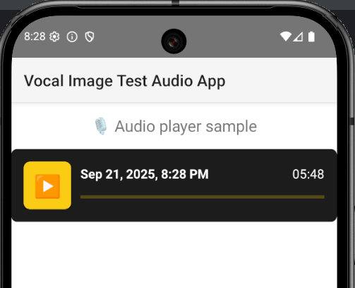

# 🎧 Vocal Image Test Audio App



This is a **NativeScript + Angular** mobile application developed as part of a **technical test assignment**.
The app implements a simple yet functional **audio player** using **Angular Signals** for state management.

---

## ✨ Features

- 📂 **Loads a sample audio file**
- ▶️⏸ **Play / Pause button** to control playback
- ⏱ **Time tracking**: shows current time and total duration (minutes:seconds format)
- 📊 **Progress bar** that updates while the audio plays
- 📝 **Displays the audio file name**

---

## 🛠 Tech Stack

- [NativeScript](https://nativescript.org/) (cross-platform mobile framework)
- [Angular](https://angular.dev/) (with standalone components & Angular Signals)
- [@nativescript/audio](https://docs.nativescript.org/plugins/audio) (NativeScript audio plugin)

---

## 🚀 Getting Started

### 1. Clone the repository

```bash
git clone https://github.com/marbirkle/audio-player-vocal-test.git
cd audio-player-vocal-test

npm install

Android
ns run android --bundle

IOS
ns run ios


## 💻 How It Works


The AudioPlayerComponent loads a local MP3 file (sample.mp3).

User can press the Play button to start playback.

Button text updates dynamically (▶️ Play ↔ ⏸ Pause).

The progress bar updates every half-second to reflect current playback time.

Labels show elapsed time and total duration in mm:ss format.

When playback finishes, the button returns to the Play state.


## 🧪 Testing

The application was successfully tested on the Android emulator using a Pixel 9 device on Android 16.0 API 36.1


## 👤 Author

Marcos M.

Built as part of a technical evaluation assignment.
```

## 📄 License

This project is licensed under the MIT License.

Copyright (c) 2025 Marcos M.

Permission is hereby granted, free of charge, to any person obtaining a copy of this software and associated documentation files (the "Software"), to deal in the Software without restriction, including without limitation the rights to use, copy, modify, merge, publish, distribute, sublicense, and/or sell copies of the Software, and to permit persons to whom the Software is furnished to do so, subject to the following conditions:

The above copyright notice and this permission notice shall be included in all copies or substantial portions of the Software.

THE SOFTWARE IS PROVIDED "AS IS", WITHOUT WARRANTY OF ANY KIND, EXPRESS OR IMPLIED, INCLUDING BUT NOT LIMITED TO THE WARRANTIES OF MERCHANTABILITY, FITNESS FOR A PARTICULAR PURPOSE AND NONINFRINGEMENT. IN NO EVENT SHALL THE AUTHORS OR COPYRIGHT HOLDERS BE LIABLE FOR ANY CLAIM, DAMAGES OR OTHER LIABILITY, WHETHER IN AN ACTION OF CONTRACT, TORT OR OTHERWISE, ARISING FROM, OUT OF OR IN CONNECTION WITH THE SOFTWARE OR THE USE OR OTHER DEALINGS IN THE SOFTWARE.
